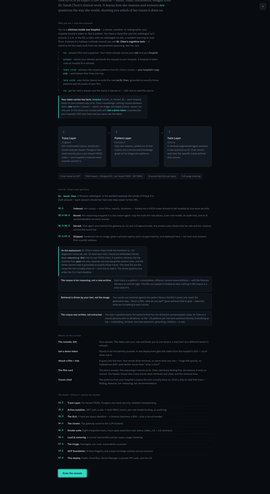
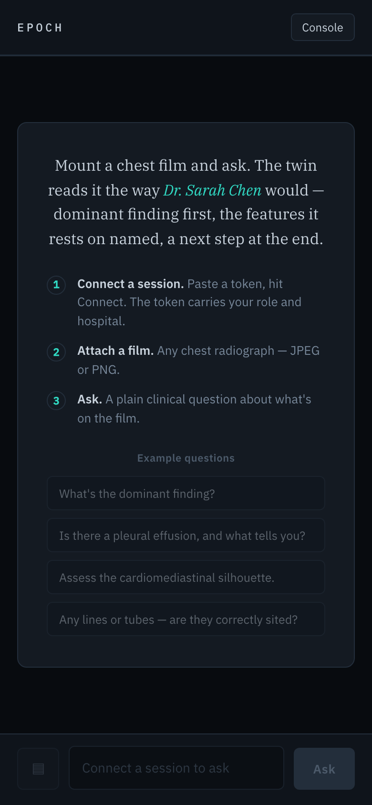
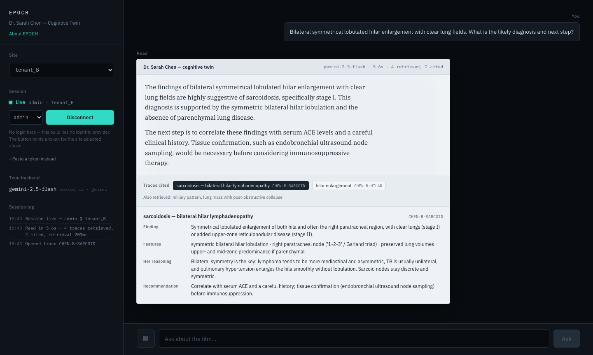

# EPOCH — Dr. Sarah Chen's Cognitive Twin

**Live:** <https://epoch-gateway-nb3a6gw7fq-uc.a.run.app>
(Cloud Run, `us-central1`, revision `epoch-gateway-00011-k8k`)

Phase 5 of the AI Engineering Masters, deployed. EPOCH builds **cognitive twins
of human experts**: feed it an expert's material and it answers new questions
the way that expert would, citing the specific traces it drew on. This
repository is the last session — the gateway, the twin's retrieval pipeline,
and a browser UI, packaged into one container and running on a public URL.

Open the URL, hit **Get a demo token**, attach a chest X-ray, ask Dr. Chen's
twin about it. No Postman, no curl.

---

## What EPOCH does

| Layer | Job | In this deployment |
|---|---|---|
| **Trace Layer** | Ingest the expert's corpus, per-tenant, per-expert | `epoch_gateway/corpus/` — ~20 diagnostic traces per hospital, embedded on boot into a per-tenant FAISS index (`retrieval.py`) |
| **Pattern Layer** | Extract how the expert reasons into a structured graph | each trace's `related` links; retrieval follows them one hop |
| **Twin Layer** | Serve a retrieval-augmented agent that answers *as the expert*, with citations | `/v1/chat` — retrieve → expand → ground a Vertex AI Gemini read on exactly those traces → return the trace IDs it used |

Multi-tenant with strict isolation (per-tenant index, JWT-bound tenant), an
8-second-class hard SLA per query (`asyncio.wait_for` → 504), and usage visible
in the response (`retrieve_ms`, `elapsed_ms`, retrieved/cited counts).

---

## Who talks to whom

You are a **clinician inside one hospital** — not a patient. You have a chest
film and no radiologist to hand: 2 a.m. in the ED, a clinic with no radiologist
on site, a resident learning to read films. Instead of a hallway consult you
ask Dr. Chen's twin.

```
YOU          upload a film + a question; your token carries your role and hospital
  │
GATEWAY      verify JWT, bind the request to your hospital (cross-tenant → 403)
  │
TRACE LAYER  retrieve the closest patterns from YOUR hospital's corpus only,
  │          then follow their pattern links one hop
  │
TWIN LAYER   Vertex Gemini writes the read AS Dr. Chen, grounded on exactly
  │          those traces and the pixels of your film
  ▼
YOU          her twin's answer + the trace IDs it drew on (click one to read it)
```

The twin is **a model of her reasoning**, not her live. She (in the product)
curates the corpus; the twin serves it when she's asleep.

---

## The UI — how it's built



### One file, no build step

The entire interface is **`epoch_gateway/static/index.html`** — one
self-contained file: a single `<style>` block, the markup, and one IIFE
`<script>`. No framework, no bundler, no separate frontend deploy. It's already
inside the `COPY epoch_gateway/ ./epoch_gateway/` line of the Dockerfile, and
`main.py` mounts it **last** so the static root never shadows an API route:

```python
app.mount("/", StaticFiles(directory="epoch_gateway/static", html=True), name="ui")
```

Type is IBM Plex (Mono / Sans / Serif) from Google Fonts with full fallback
stacks; everything else is inline. Rebuild the image, redeploy — that ships the
UI.

### Design: a reading-room instrument, not a chat toy

Radiology reading rooms are dark by design, and radiology workstations have
long used monochrome readouts — so a dark shell here is grounded in the
subject, not a default. The distinctive move is the **light "film" surface**:
the twin's answer lands on an illuminated `#ECF0F4` panel as dark serif report
text, the way a film sits on a lightbox, against the dark instrument chrome
around it.

- **Colour** — `--film #080B0F` ground, `--panel #141A22` for raised panels,
  hairline `--seam` for panel edges. Phosphor teal (`--phosphor #31DAC4`) is a
  *status and action* signal — the live dot, the primary button, trace links —
  used in about four places, never as decoration.
- **Type, three roles** — Plex **Mono** for the `EPOCH` nameplate and machine
  IDs (trace IDs, model names); Plex **Sans** for all chrome; Plex **Serif**
  for the twin's answer, because a dictated read reads as prose.
- **Quality floor** — responsive with relative units (the console collapses to
  a `Console` button under 820px), visible keyboard focus, `prefers-reduced-
  motion` respected, `aria-live` on the conversation thread, theme committed to
  dark and painted explicitly.

### The briefing

First visit opens a full-screen briefing that walks the whole story — what
EPOCH is, **who you are and the message path above**, the three layers, the
platform properties, **how Dr. Chen's twin was built session by session**, an
honest "what's real vs. stubbed on this deployment" block, and a
UI→architecture map. It's remembered after dismissal (`localStorage`), and
**About EPOCH** in the console reopens it. `Esc`, the `×`, and *Enter the
console* all close it.

### The console (left rail)



- **Site** — `tenant_A` / `tenant_B`. Also the `X-Tenant-ID` sent on every
  read; changing it to a tenant your token isn't bound to warns you *before*
  the server 403s.
- **Session** — one-click **Get a demo token** (role selector + button →
  `POST /v1/dev-token`, which fills the field and connects), or a *Paste a
  token instead* disclosure for a `mint_jwt.py`-issued token. The token is
  decoded client-side to show its `role · hospital` and auto-bind the Site.
  State is decisive: `Offline` (amber dot, composer dead, examples disabled)
  vs `Live` (teal dot).
- **Twin backend** readout and a **session log** that records every action
  with timings.

### The read and its traces



The answer renders on the film card. A light in-file markdown pass handles
`**bold**`, `` `code` ``, and `*`/`-` bullets — no library. The header strip
shows the model, elapsed seconds, and `N retrieved, M cited`.

**"Traces cited"** are the real trace IDs the twin reported using
(`TRACES_USED:` line, intersected with what was retrieved), each labelled with
its pattern name. Click a chip → `GET /v1/trace/{id}` (JWT + tenant checked) →
an inline panel opens with the source: finding, discriminating features, *her
reasoning*, *her recommendation*. "Also retrieved" lists the near-misses.

### Failure surfaces

Errors speak in the interface's voice, never an apology: `401` → "Session
token rejected. Mint a fresh token and connect again."; `403` → "Cross-site
read refused…"; `504` → "Read exceeded the SLA — the 15.3 hard deadline
fired…"; network errors are caught. A pending read shows a scanning bar.

### What it deliberately does not do

It never mints a *real* JWT client-side — auth issuance is a separate concern,
and `/v1/dev-token` is a flag-gated demo seam. It stores only the token and a
"seen the briefing" flag, both in `localStorage`.

---

## API surface

| Method | Path | Auth | Purpose |
|---|---|---|---|
| `GET` | `/health` | — | liveness; reports `tenant_isolation` |
| `GET` | `/` | — | the UI (StaticFiles, mounted last) |
| `POST` | `/v1/chat` | Bearer | the twin: retrieve → one-hop expand → grounded Gemini read → real `cited_traces`; runs under `EPOCH_SLA_SECONDS` (→ 504) |
| `GET` | `/v1/trace/{id}` | Bearer | one trace, tenant-scoped (cross-tenant id → 404, not 403) |
| `GET` | `/v1/twin/status` | — | index backend + per-tenant trace counts |
| `POST` | `/v1/dev-token` | — (flag) | mint a demo bearer token; `404` unless `EPOCH_DEMO_TOKENS` is on |
| `GET` | `/cluster/health` | — | Week 16 backend status, unchanged |
| `POST` | `/v1/agent/invoke`, `/v2/agent/invoke` | Bearer | Week 16 JSON invoke routes (v1 carries Deprecation/Sunset), unchanged |

### Configuration (environment)

| Var | Default | Notes |
|---|---|---|
| `GOOGLE_CLOUD_PROJECT` | — | required; Vertex AI project |
| `GOOGLE_CLOUD_LOCATION` | `us-central1` | Vertex region |
| `EPOCH_GENAI_MODEL` | `gemini-2.5-flash` | the twin's read model |
| `EPOCH_EMBED_MODEL` | `text-embedding-004` | corpus + query embeddings |
| `EPOCH_TWIN_TOPK` | `4` | traces retrieved before the one-hop expansion |
| `EPOCH_SLA_SECONDS` | `15` | 15.3 hard deadline; spec target is 8, but gemini-2.5-flash vision runs 5–12s |
| `EPOCH_TENANT_ISOLATION` | `active` | `active` enforces the cross-tenant check |
| `EPOCH_DEMO_TOKENS` | `off` | `on` enables `/v1/dev-token` (a deliberate hole — demo only) |
| `JWT_SECRET` | demo value | from Secret Manager (`jwt-secret`) in the deploy |
| `GEMINI_API_KEY` | — | mapped from Secret Manager to match the prompt; **unused** — the twin uses Vertex ADC |

---

## The Trace Layer

`epoch_gateway/corpus/chen_traces.py` holds Dr. Chen's corpus — ~20 diagnostic
traces per site (`CHEN-A-*` / `CHEN-B-*`), each with the finding, the
discriminating features, her reasoning, her recommendation, and `related`
links. tenant_A is an acute/trauma service, tenant_B a chronic-disease centre;
the shared fundamentals are materialised separately per tenant so the two
indexes never overlap.

`epoch_gateway/retrieval.py` embeds each site's traces on boot with Vertex
`text-embedding-004` into its own `faiss.IndexFlatIP`. `/v1/chat` retrieves the
top-`EPOCH_TWIN_TOPK` from the **caller's tenant index only**, expands one hop
along `related`, grounds the Gemini read on exactly those traces, and returns
`cited_traces` = the IDs the model reported using.

Isolation is demonstrable: ask both sites *"bilateral symmetrical lobulated
hilar enlargement, clear lungs — diagnosis?"* — tenant_B retrieves
`CHEN-B-SARCOID` and answers "stage I sarcoidosis"; tenant_A has no sarcoid
trace and can only answer generically.

**Honest scope:** the corpus is her *reasoning patterns*, not a case archive —
your uploaded film is treated as new. Retrieval is driven by your *text*, not
the image (the pixels reach only the generation step). And the ~20 patterns
per site were *authored* directly rather than extracted from raw dictations,
because Dr. Chen is a course persona. Everything on top — embedding,
retrieval, one-hop expansion, grounding, citations — is real. Fuller detail,
plus the deploy runbook and the 12-item production checklist, is in
[`epoch-deploy/README.md`](epoch-deploy/README.md).

---

## Repository layout

```
.
├── README.md                       this file
├── epoch_gateway/                   the application (baked into epoch-api:v1)
│   ├── Dockerfile                   linux/amd64 build: slim Python, non-root
│   ├── requirements.txt             pinned deps — used by the Dockerfile and local dev
│   ├── main.py                      FastAPI app — /v1/chat, /v1/trace, /v1/dev-token, UI mount
│   ├── epoch_auth.py               JWT verification (Week 16 contract, unchanged)
│   ├── retrieval.py                 Trace Layer — Vertex embeddings + per-tenant FAISS
│   ├── corpus/
│   │   └── chen_traces.py           Dr. Chen's diagnostic corpus (~20 traces / tenant)
│   └── static/
│       └── index.html               the entire browser UI (one file)
├── epoch-deploy/                    deployment
│   ├── bootstrap.sh                 one-time GCP foundation (idempotent)
│   ├── deploy.sh                    build + push + gcloud run deploy
│   ├── rollback.sh                  status / split / rollback against live revisions
│   ├── verify.sh                    the 8 post-deploy checks
│   ├── mint_jwt.py                  CLI bearer-token minter (fallback to the UI button)
│   ├── chest_xray_sample.jpg        synthetic placeholder film for the demo
│   └── README.md                    deploy runbook + Trace Layer detail + checklist
└── docs/                            screenshots referenced above
```

---

## Run it from a clean clone

**Prerequisites:** Python 3.12, Docker with `buildx`, the `gcloud` CLI
authenticated, and Application Default Credentials for Vertex AI
(`gcloud auth application-default login`). Without ADC, the app runs but
`/v1/chat` returns `503`.

### Locally

```bash
git clone <this-repo> && cd <repo>
python -m venv .venv && source .venv/bin/activate
pip install -r epoch_gateway/requirements.txt
export GOOGLE_CLOUD_PROJECT=<your-project> EPOCH_DEMO_TOKENS=on
uvicorn epoch_gateway.main:app --port 8000
# open http://localhost:8000
```

or the container (build context is the **repo root**):

```bash
docker buildx build --platform linux/amd64 -f epoch_gateway/Dockerfile -t epoch-api:v1 .
docker run -p 8000:8000 -e GOOGLE_CLOUD_PROJECT=<p> -e EPOCH_DEMO_TOKENS=on epoch-api:v1
```

### Deploy to Cloud Run

From a clean clone, against a GCP project with billing linked and `gcloud`
authenticated:

```bash
cd epoch-deploy
export GCP_PROJECT=<your-project>
bash bootstrap.sh    # one-time: APIs, Artifact Registry, epoch-gateway-sa + 5 roles,
                     #           jwt-secret + gemini-api-key, epoch-vpc-connector
bash deploy.sh       # builds + pushes the linux/amd64 image, then gcloud run deploy
bash verify.sh       # 8 checks; ends: ✓ Session 17.3 COMPLETE. EPOCH Phase 5 is live.
```

All three scripts are idempotent. `deploy.sh` takes `SKIP_BUILD=1` to reuse
the image already in Artifact Registry; it requests `max-instances=100` and
falls back to `20` on a fresh project's CPU quota.

---

## The build, step by step

Phase 5 built Dr. Chen's twin one session at a time:

| | | |
|---|---|---|
| **15.1** | Trace Layer | per-tenant FAISS, Postgres row-level security, isolated checkpointing |
| **15.2** | Action isolation | JWT auth, a role→tools RBAC matrix, per-role model binding, an audit log |
| **15.3** | The SLA | a hard per-query deadline — a timeout becomes a 504 — plus a circuit breaker |
| **16.1** | The cluster | the gateway wired to the LLM backend |
| **16.2** | Smoke suite | eight integration tests, trace-span assertions over status codes, `/v1` + `/v2` contracts |
| **16.x** | Load & metering | a Locust load profile and per-query usage metering |
| **17.1** | The image | packaged, non-root, vulnerability-scanned |
| **17.2** | GCP foundation | Artifact Registry and a least-privilege runtime service account |
| **17.3** | This deploy | public Cloud Run + Secret Manager + a private VPC path, and everything in this repo |

Session 17.3, concretely: the 17.1 image was rebuilt for `linux/amd64` (the
original was arm64 and won't start on Cloud Run); `/v1/chat` was given the real
retrieval pipeline (`corpus/` + `retrieval.py`, Vertex embeddings, per-tenant
FAISS, one-hop pattern expansion, grounded Gemini read, real citations under
the 15.3 deadline); the browser UI and the first-visit briefing were built into
the image; secrets, a Serverless VPC connector, and `roles/aiplatform.user`
were provisioned; and `deploy.sh` / `verify.sh` were fixed to deploy it public
and prove it.

**Live:** <https://epoch-gateway-nb3a6gw7fq-uc.a.run.app> — open it, hit *Get a
demo token*, attach a chest film, and read Dr. Chen's twin.
